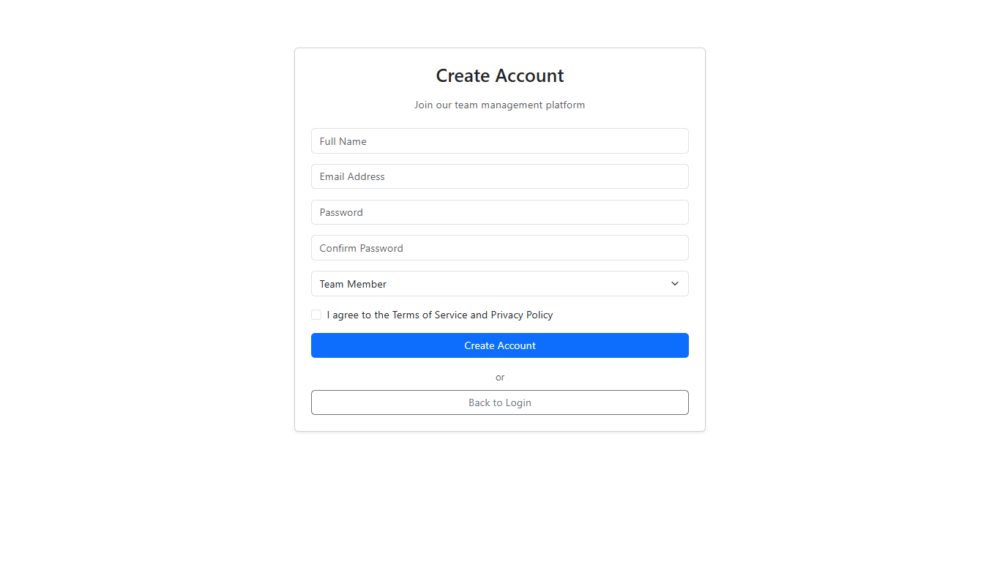
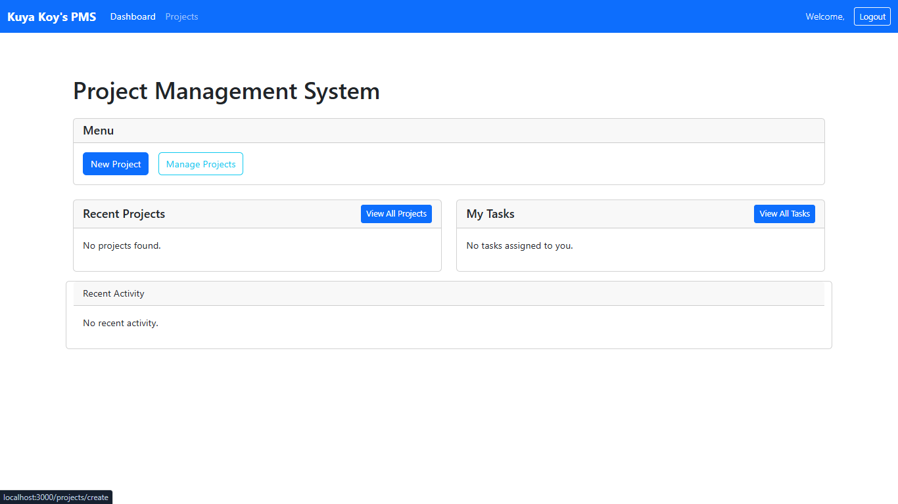
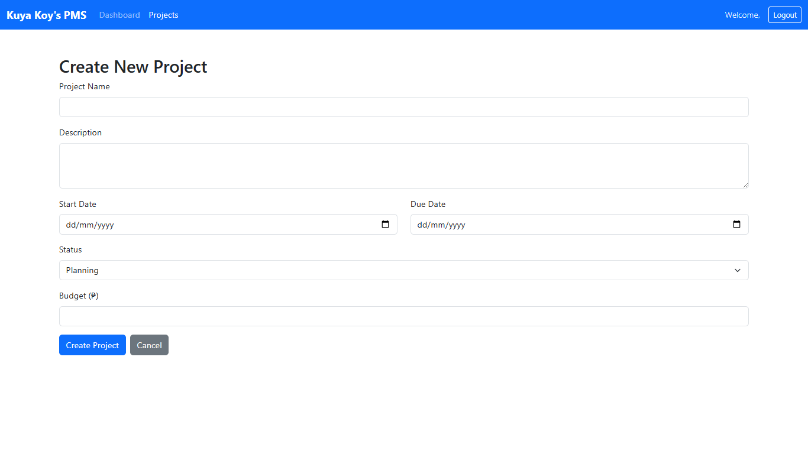
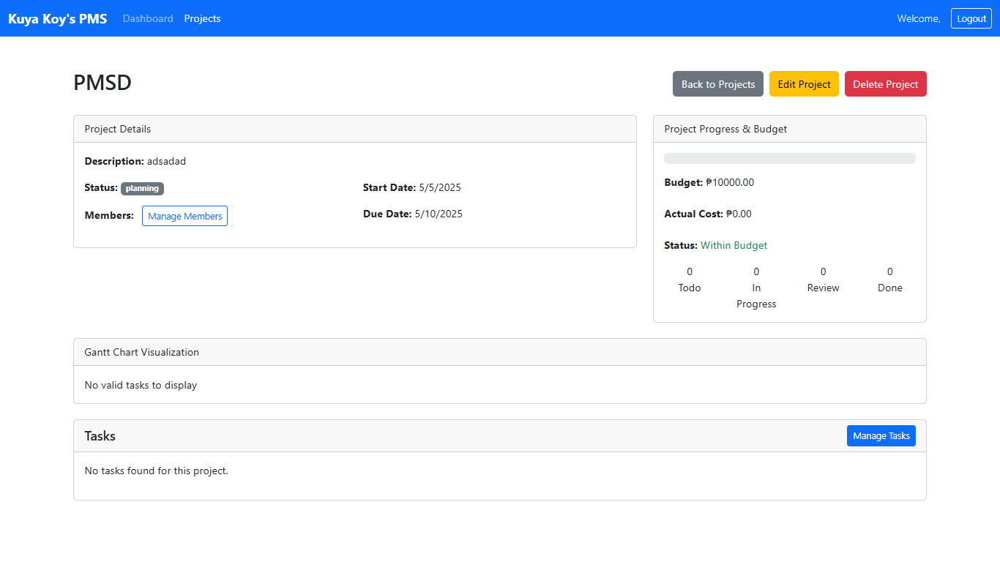
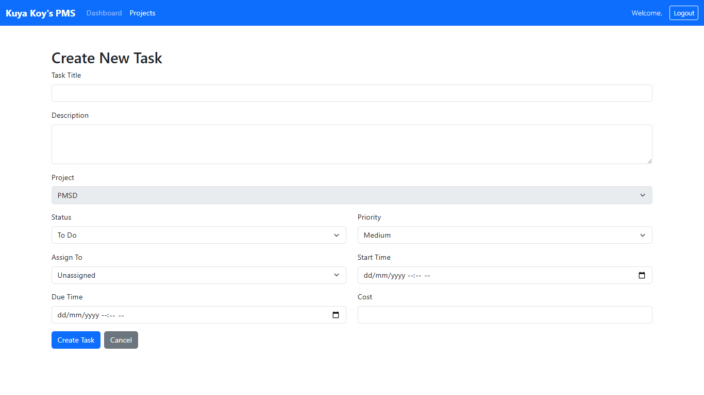
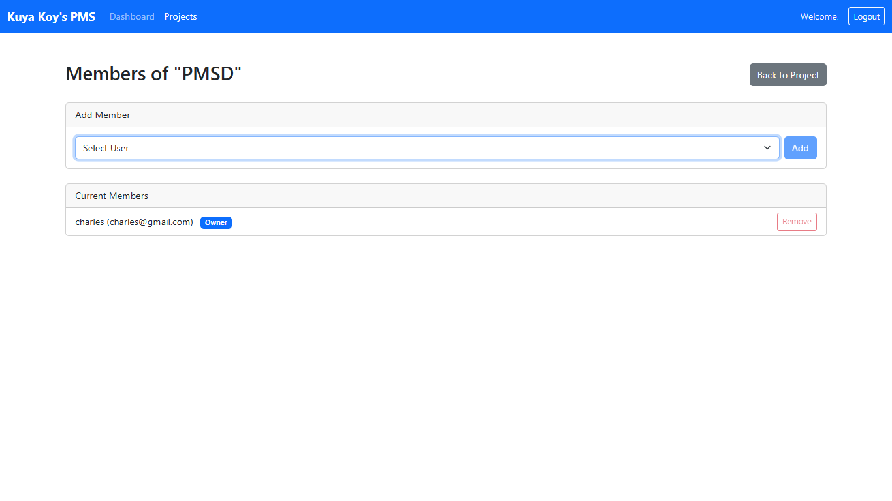
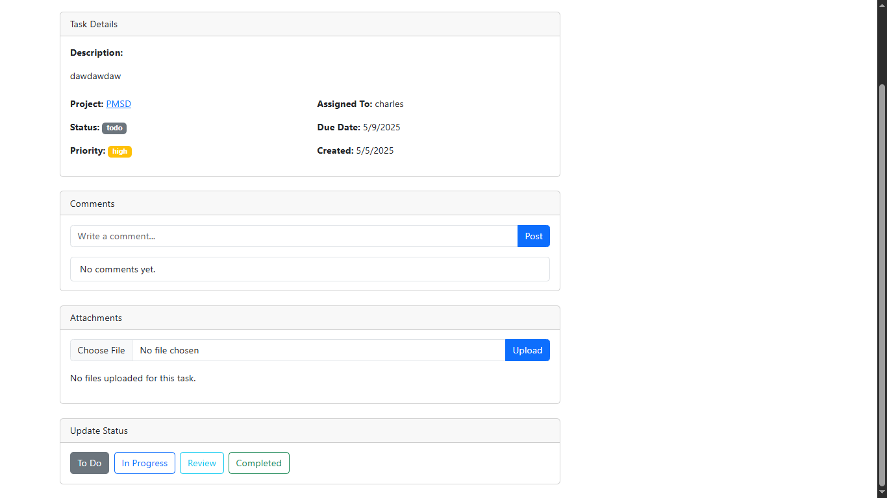
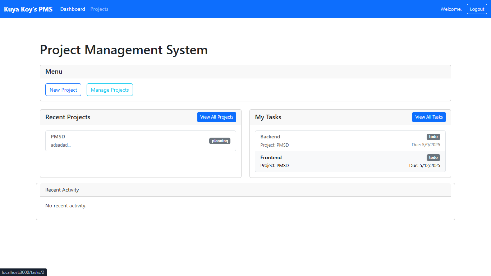

# TaskMan User Guide

## **Last Updated:** [04/01/2025]

## Table of Contents

1. [Account Management](#1-account-management)
2. [Projects](#2-projects)
3. [Task](#3-task)
4. [ResourceBudget](#4-ResourceBudget)
5. [Collaboration](#5-Collaboration)
6. [ReportingRiskManagement](#6-ReportingRiskManagement)

---

## 1. Account Management

## **1. Account Management** _(Sprint 1 Features)_

### ** User Registration**

**Customer**

1. Click **"Register"** on the login page.
2. Fill in:
   - Full Name
   - Email
   - Password
   - Password (confirm)
   - Role (Team Member/Project Manager/client)
3. Click **"Register"**.

### **Login/Logout**

- **Login**: Enter email/password → Click **"Login"**.
- **Logout**: Click your profile picture → **"Logout"**.

---

## 2. Projects

## **2. Projects** _(Sprint 2 Features)_

### **Creating a Project**

1. Navigate to **Projects** → **New Project**.
   

2. Enter:
   - **Project Name**
   - **Description**
   - **Start Date & Due Date**
   - **Budget**
     
3. Click **Save**.

### **Editing/Deleting Projects**

- **Edit**: Open project → Click **⋮ (Options)** → **Edit**.
- **Delete**: Open project → **⋮** → **Delete**
  

---

## 3. Task

**3. Tasks** _(Sprint 2 Features)_

### **Creating a Task**

1. Open a project → Click **"+ Task"**.
2. Fill in:
   - **Task Title**
   - **Description**
   - **To Do**
   - **Assigned To**
   - **Start Time**
   - **Due Time**
   - **Priority**
   - **Cost**
     

### **Assigning Tasks**

1. Open a task → Click **"Assign"**.
2. Select a team member → **Confirm**.
   

### **Updating Status**

Drag tasks between columns:

- **To Do** → **In Progress** → **Done**.
  

---

## **Visual Guides** _(Add screenshots later)_

---

## 4. ResourceBudget

**4. ResourceBudget**

### Allocating Team Members

1. Open task → Click **"Allocate Resource"**
2. Select member + set weekly hour cap → **Confirm**

### Tracking Time

- **Manual Entry**: Click **"Log Time"** → Enter hours.
- **Timer**: Click ⏱️ icon to track real-time.

### Viewing Budget

Navigate to **Project → Finance Dashboard** to see:

- Planned vs. actual spending
- Burn rate visualization

---

## 5. Collaboration

**5. Collaboration**

### Commenting on Tasks

1. Open task → Click **"Add Comment"**
2. Type your message with @mentions → **Post**

### Sharing Files

- Drag files into any comment box
- View all project files under **Documents** tab

## 6. ReportingRiskManagement

**6. ReportingRiskManagement**

### Generating Reports

1. Navigate to **Reports** → Select project
2. Choose format (PDF/Excel/JSON) → **Generate**  
   

### Understanding Analytics

- **Budget Tracking**:
  - 🟢 On track (<75% spent)
  - 🟡 Warning (75-90% spent)
  - 🔴 Over budget (>90%)
- **Team Productivity**: Hours logged vs. estimated

### Managing Risks

1. Go to **Project → Risks**
2. Click **"+ Risk"** and fill in:
   - Description
   - Severity (Low/Medium/High)
   - Mitigation plan  
     

#
